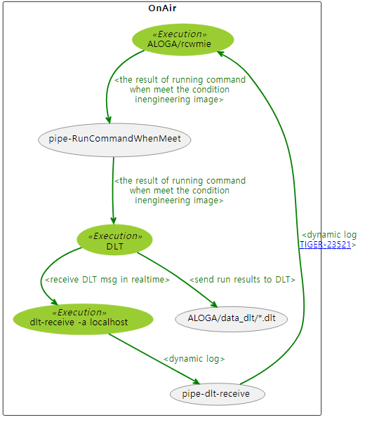
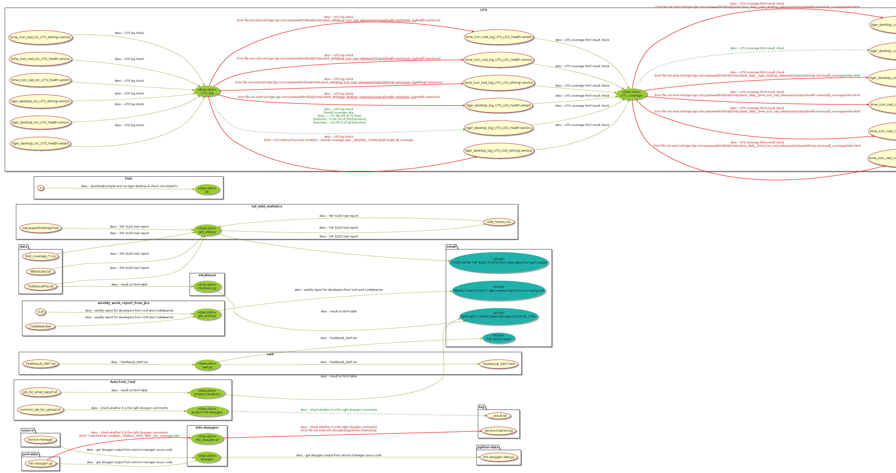

# processMap
- plantuml for process Map with the result of checking status

# example
## example 1
- input csv:[/simple.processmap.csv](./simple.processmap.csv)  & json[simple.processmap.json](./simple.processmap.json)
    - 
## example 2
- input [processMap.csv](./processmap.csv)
    - 

# description of fields
- "Project": "OnAir",
    - it must have value
    - it makes box in total.md.
    - it makes separate md file with Project name.  ex) OnAir.md
- "From": "DLT",
    - it must have  "From" or "To".
    - input for "Exection"
- "Execution": "dlt-receive -a localhost",
    - it must have value
    - running item
- "To": "pipe-dlt-receive",
    - it must have  "From" or "To".
    - output from "Exection"
- "FromLocation": "",
    - check existence of file location. red line if it does not exist.
    - if it starts with "ssh:server_name:location" , it means to check remote server
        - ex) ssh:better.life.com:/var/www/html/DailyTest/Latest_daily__[cmu-project]_release/[TODAY]/utsOutput/[cmu-uts-module]/uts_log__[cmu-uts-module].txt
- "FromSuccessCheckPoint": "",
    - if "FromLocation" file has this value , it is success.   if fail , red line
- "FromFailCheckPoint": "",
    - if "FromLocation" file has this value , it is fail.   if fail , red line
- "FromShowCheckPoint": "",
    - show this line in edge if line of file content has this keywords
- "FromType": "text",
    - type : "text" or "binary" (default : binary)
    - we can check the contents of "FromLocation" file for "FromFailCheckPoint" or "FromSuccessCheckPoint" if it is "text".
- "FromLastTime": "",
    - file update date - periodic date < now is ok
- "FromResult": "",
- "FromDescription": "receive DLT msg in realtime", 
    - From -- Execution 's edge description
- "ToLocation": "",
- "ToSuccessCheckPoint": "",
- "ToFailCheckPoint": "",
- "ToShowCheckPoint": "",
- "ToType": "text",
- "ToLastTime": "",
- "ToResult": "",
- "ToDescription": "dynamic log",
- "Periodic": "",
    - file update date + periodic date >= now is ok
- "Replace": "",
    - this is list name.  if you want to use list repeatedly , you put list filename.
        - ex) cmu
            - it has cmu.list , model.list separately. 
            - if cmu.list has 3 line (aaa,bbb,ccc) , [cmu] will replace this row to list (aaa,bbb,ccc) for each row.
        - ex) cmu,model
            - cmu = [aaa,bbb,ccc] , model = [m1 , m2, m3,m4] => row will be extended into 12 rows (3 * 4)
    - replacement element ([cmu] , [model]) are used in all fields
- "Description": "",
    - From -- Execution -- To 's both edge description
- "Virtical": "O"
    - if Virtical has more than one "O" , plantuml direction is vertical.

# plantuml server : how to service and use
- plantuml
    - plantuml site : https://plantuml.com/ko/
    - plantuml server : https://plantuml.com/ko/server
- how to service plantuml server with docker : https://github.com/plantuml/plantuml-server
    - docker run -d -p 18080:8080 plantuml/plantuml-server:tomcat
        - I run it in lotto645.lge.com. so i can change host port
    - http://lotto645.lge.com:18080
- how to use this server
    - http://lotto645.lge.com:18080
    - show the plantuml directly without any form
        - http://lotto645.lge.com:18080/proxy?fmt=svg&src=[plantuml 이 있는 file의 위치]
        - ex)
            - http://lotto645.lge.com:18080/proxy?fmt=svg&src=http://lotto645.lge.com:8088/cheoljoo.lee/code/mouse/DDPI-dailyTodo.md 
            - http://lotto645.lge.com:18080/proxy?fmt=svg&src=http://lotto645.lge.com:8088/cheoljoo.lee/code/mouse/total.md

# usage
- $ python3 draw_pm.py --help
```
usage: input file : csv or json file

if you want to use plantuml proxy server , 
  --plantumlproxyserver=better.life.com:18080
  --plantumlid=your_id                                        [your_id]
  --plantumlfileserver=file.server.com
  --plantumlfileserveruser=[file.server.com's user id]
  --plantumlfileserverpasswd=[file.server.com's user password]
  --plantumlfileserverdirectory=DailyTest/zip-plantuml        [file.server.com's directory to save]
url =>  http://better.life.com:18080/proxy?fmt=svg&src=http://file.server.com/DailyTest/zip-plantuml/your_id-simple.processmap.csv-total.md 

draw_pm.py generates plantuml for process map.

optional arguments:
  -h, --help            show this help message and exit
  --authname <id>       host id ex) cheoljoo.lee without @
  --authpasswd <passwd>
                        host passwd
  --input <str>         input csv/json file - default : processmap.csv
  --outdir <str>        output directory to have md - default : .
  --debug               for debug
  --brief               show brief graph
  --local               just use absolute path instead of ssh
  --plantumlproxyserver <str>
                        input file : csv or json file if you want to use
                        plantuml proxy server ,
                        --plantumlproxyserver=better.life.com:18080
                        --plantumlid=your_id [your_id]
                        --plantumlfileserver=file.server.com
                        --plantumlfileserveruser=[file.server.com's user id]
                        --plantumlfileserverpasswd=[file.server.com's user
                        password] --plantumlfileserverdirectory=DailyTest/zip-
                        plantuml [file.server.com's directory to save] url => 
                        http://better.life.com:18080/proxy?fmt=svg&src=http://
                        file.server.com/DailyTest/zip-plantuml/your_id-
                        simple.processmap.csv-total.md
  --plantumlid <str>    input file : csv or json file if you want to use
                        plantuml proxy server ,
                        --plantumlproxyserver=better.life.com:18080
                        --plantumlid=your_id [your_id]
                        --plantumlfileserver=file.server.com
                        --plantumlfileserveruser=[file.server.com's user id]
                        --plantumlfileserverpasswd=[file.server.com's user
                        password] --plantumlfileserverdirectory=DailyTest/zip-
                        plantuml [file.server.com's directory to save] url => 
                        http://better.life.com:18080/proxy?fmt=svg&src=http://
                        file.server.com/DailyTest/zip-plantuml/your_id-
                        simple.processmap.csv-total.md
  --plantumlfileserver <str>
                        input file : csv or json file if you want to use
                        plantuml proxy server ,
                        --plantumlproxyserver=better.life.com:18080
                        --plantumlid=your_id [your_id]
                        --plantumlfileserver=file.server.com
                        --plantumlfileserveruser=[file.server.com's user id]
                        --plantumlfileserverpasswd=[file.server.com's user
                        password] --plantumlfileserverdirectory=DailyTest/zip-
                        plantuml [file.server.com's directory to save] url => 
                        http://better.life.com:18080/proxy?fmt=svg&src=http://
                        file.server.com/DailyTest/zip-plantuml/your_id-
                        simple.processmap.csv-total.md
  --plantumlfileserveruser <str>
                        input file : csv or json file if you want to use
                        plantuml proxy server ,
                        --plantumlproxyserver=better.life.com:18080
                        --plantumlid=your_id [your_id]
                        --plantumlfileserver=file.server.com
                        --plantumlfileserveruser=[file.server.com's user id]
                        --plantumlfileserverpasswd=[file.server.com's user
                        password] --plantumlfileserverdirectory=DailyTest/zip-
                        plantuml [file.server.com's directory to save] url => 
                        http://better.life.com:18080/proxy?fmt=svg&src=http://
                        file.server.com/DailyTest/zip-plantuml/your_id-
                        simple.processmap.csv-total.md
  --plantumlfileserverpasswd <str>
                        input file : csv or json file if you want to use
                        plantuml proxy server ,
                        --plantumlproxyserver=better.life.com:18080
                        --plantumlid=your_id [your_id]
                        --plantumlfileserver=file.server.com
                        --plantumlfileserveruser=[file.server.com's user id]
                        --plantumlfileserverpasswd=[file.server.com's user
                        password] --plantumlfileserverdirectory=DailyTest/zip-
                        plantuml [file.server.com's directory to save] url => 
                        http://better.life.com:18080/proxy?fmt=svg&src=http://
                        file.server.com/DailyTest/zip-plantuml/your_id-
                        simple.processmap.csv-total.md
  --plantumlfileserverdirectory <str>
                        input file : csv or json file if you want to use
                        plantuml proxy server ,
                        --plantumlproxyserver=better.life.com:18080
                        --plantumlid=your_id [your_id]
                        --plantumlfileserver=file.server.com
                        --plantumlfileserveruser=[file.server.com's user id]
                        --plantumlfileserverpasswd=[file.server.com's user
                        password] --plantumlfileserverdirectory=DailyTest/zip-
                        plantuml [file.server.com's directory to save] url => 
                        http://better.life.com:18080/proxy?fmt=svg&src=http://
                        file.server.com/DailyTest/zip-plantuml/your_id-
                        simple.processmap.csv-total.md
```
